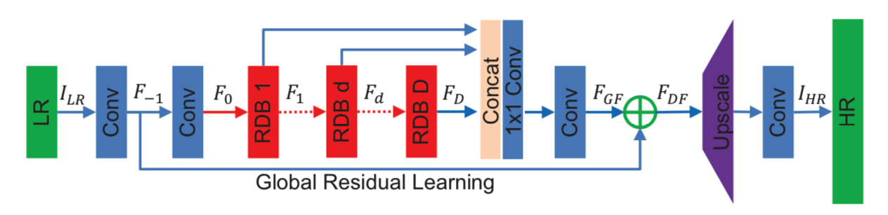
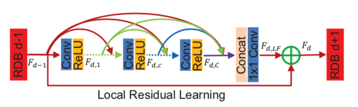

# Image Super Resolution Using SRCNN and ResDenseNet
## Overview
Single image super-resolution is a challenging image processing task, which aims at recovering a high- resolution image from a single low-resolution image.

In this project, we implement two supervised CNN structures to solve the super-resolution problem, which are the super-resolution convolutional neural network (SRCNN) and the residual dense network (RDN). To improve the model training efficiency, we optimize the SRCNN model with batch normalization. 

## SRCNN Model

* Training data set: 91 image dataset with an extraction stride of 14, and each sub-image is of width and height 33 pixels
* Model reference:[Image Super-Resolution Using Deep Convolutional Networks](http://mmlab.ie.cuhk.edu.hk/projects/SRCNN.html)

## RDN Model
 

* Training data set: 91 image dataset with four corner and a central crop
* Model reference:[Residual Dense Network for Image Super-Resolution](https://arxiv.org/pdf/1802.08797.pdf)

## File structure
* SRCNN folder: all the code, test and training results using SRCNN model.
* RDN folder: all the code, test and training results using RDN model.

## Results 
Simulation results show that our SRCNN, SRCNN+BN and RDN models all improve the quality of output images. Among them, SRCNN has the best PSNR and SSIM performance, but RDN has great potential to achieve greater performance by increasing the number of training epoches and the size of training set.

## Link to Code Reference (https://github.com/yjn870/RDN-pytorch)
